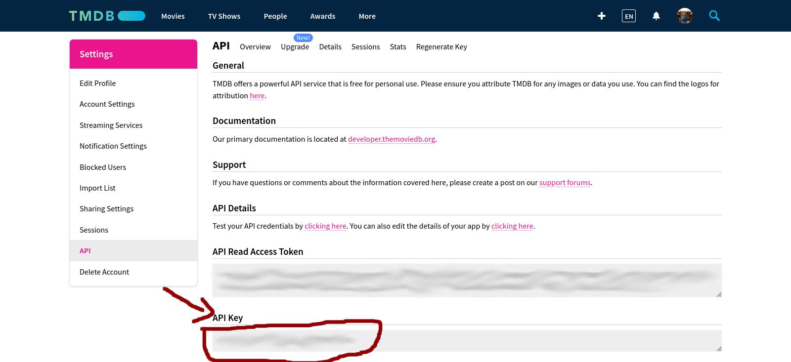

# 🪦riptvtime🥀🕊️

A lightweight, self-hosted TV show tracker inspired by **TV Time**.

Track the shows you're watching, keep up with upcoming episodes, mark episodes as watched or rewatched, and see how much of your life you've spent watching TV — without relying on a third-party tracking service.

## ✨ Features

### 📺 Watch Next

Get a feed of episodes you should watch next from the TV shows you're currently following.

### 🔍 TV Show Management

* Search for TV shows
* Add shows to your watch list
* Stop watching a show
* Remove a show
* Keep your watch history locally

### ✅ Episode Tracking

Mark individual episodes as:

* Watched
* Unwatched
* Rewatched

You can also quickly mark all previous episodes of a show as watched.

### 📅 Upcoming Episodes

See upcoming episodes that haven't aired yet, so you know what's coming next.

### 📊 Watch Statistics

Track your total time spent watching TV.

The total is calculated from episodes that count towards your watched/rewatched history.

### 📦 TV Time GDPR Import

Already have years of history on TV Time?

riptvtime can import your **TV Time GDPR data**, allowing you to migrate your existing viewing history instead of starting from scratch.


## 🖼️ Screenshots

[SCREENSHOTS.md](docs/SCREENSHOTS.md)

---

## 🛠️ Tech Stack

The project is built around a simple architecture with minimal dependencies.

* **Backend:** Go
* **Database:** SQLite (CGO Free)
* **Frontend:** Vue 3 (ES6 Modules/No Build Step)
* **TV metadata:** TMDB

This projects doesn't require `gcc` or a `javascript` runtime to compile

---

## ⚙️ Configuration

riptvtime requires a **TMDB API key** to search for TV shows and retrieve episode information.

You can provide a configuration file when starting the application:

```
rtt.exe config.cfg
```

If no configuration file is provided, riptvtime will start an onboarding page where you can enter the required configuration details. The configuration can then be completed through the web UI without manually creating a config file.

Example configuration:

```text
TmdbApiKey=your_tmdb_api_key
Ip=127.0.0.1
Port=5667
TmdbMaxRetries=10
```

### FREE TMDB API Key

To register for an API key, click the <a href="https://www.themoviedb.org/settings/api" target="_blank" rel="noopener noreferrer">API link</a> from within your account settings page.


---

## 📥 Importing TV Time Data

If you have previously used TV Time, you can request your personal data through their GDPR/data export process.

Once you receive your exported data, riptvtime can import the relevant TV show and episode history.

This makes it possible to move your existing watch history to riptvtime.

---

## 🧮 How Watch Time Works

riptvtime calculates your total watch time from episodes that count towards your viewing history.

Rewatching an episode can therefore contribute additional time to the total.

For example:

```text
Episode A — watched once       → 45 min
Episode B — watched once       → 50 min
Episode A — rewatched          → 45 min

Total                         → 140 min
```

The goal is to represent **actual viewing time**, rather than simply counting unique episodes.

---

## 🗺️ Roadmap

The core functionality is already implemented, but there's plenty of room to improve the project.

Possible future improvements:

* [ ] Genres
* [ ] Movie Tracking
* [ ] Better statistics
* [ ] Discover/Recommendations based on Genres
* [ ] UI to resolve unimported series/episodes

---

## 🤝 Contributing

Contributions, bug reports, and feature ideas are welcome.

If you find a bug or have an idea for improving riptvtime, feel free to open an issue.

Pull requests are also welcome.

---

## 📄 License

See the [`LICENSE`](LICENSE.md) file for license information.

---

## ❤️ Why?

TV tracking services are useful, but sometimes you just want a small application that does one thing well:

**Tell me what I should watch next.**

riptvtime is an attempt to build exactly that.
